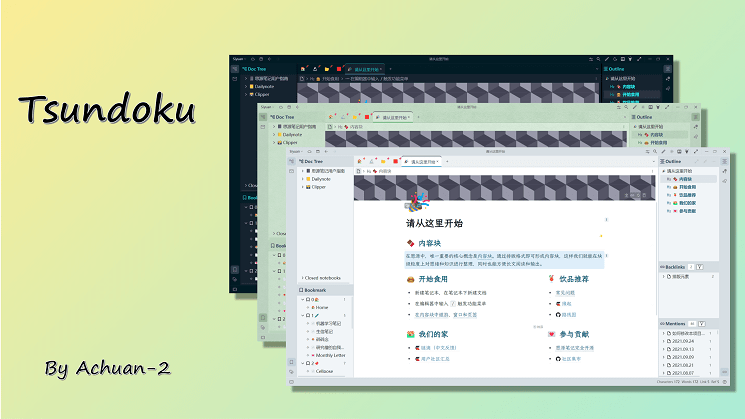

<h1 align="center">🌞Tsundoku: A Theme for SiYuan Note</h1>

<p align="center">          
           <a title="Hits" target="_blank" href="https://github.com/Achuan-2/siyuan-themes-tsundoku-light"></a>
           <a title="GitHub release (latest by date including pre-releases)" target="_blank" href="https://github.com/Achuan-2/siyuan-themes-tsundoku/releases/latest">
                 
           </a>
           
           
           
          
</p>

English  | [中文](./README_zh_CN.md)  




> 📢 Announcement: Due to the lack of sponsorship revenue from theme development and the increasing richness of SiYuan themes, this theme has entered maintenance mode. I will no longer respond to user questions and requests, and will only make casual updates based on personal needs.

---

> If you like this theme, welcome to [buy me a snack](https://www.yuque.com/achuan-2), which will motivate me to update and improve the theme.

**Introduction**: [SiYuan](https://github.com/siyuan-note/siyuan) is a privacy-first personal knowledge management system that supports completely offline use and end-to-end encrypted synchronization. It combines blocks, outlines, and bidirectional links to build your eternal digital garden. This theme is a personal original theme, specially designed for SiYuan notes.

## 🚀 Recent Updates

For the complete update log, please see [CHANGELOG](https://cdn.jsdelivr.net/gh/Achuan-2/siyuan-themes-tsundoku@main/CHANGELOG.md)

## Star History

[](https://star-history.com/Achuan-2/siyuan-themes-tsundoku&Date)

## 💌 Origin

🎉 The theme was first born on February 22, 2021.

Tsundoku "積 ん 読" is a word in Japanese. Wikipedia explains it like this: "Tsundoku is acquiring reading materials but letting them pile up in one's home without reading them. It is also used to refer to books ready for reading later when they are on a bookshelf." Simply put, it is the behavior of buying books addictively but not reading them.

> Any PKM approach that doesn't tie into execution tools is destined to languish on the back burner forever.

The biggest obstacle to using a tool is "unclear requirements". If you don't know what your recording requirements are, the more functions there are, the greater the possible obstacles, and it is easy for people to get caught up in various research on functions. After using a pile of notebook software, you will understand that the most important thing to improve is not the tools you use, **but yourself**.

I use this name to wake myself up, hoping to make good use of SiYuan notes, help me to be task-oriented, take notes to complete tasks and achieve goals, better master knowledge and skills, strive to do meaningful projects and become a better person. Instead of taking notes for the sake of taking notes, making the note-taking software become dust boxes that relieve knowledge anxiety and satisfy abnormal digital hoarding syndrome.

## 🐯 Theme Features

- ✨ **Three-in-one theme, supporting both light mode and dark mode** (Tsundoku Light, Tsundoku Green, Tsundoku Dark)
  - SiYuan note light mode only supports selecting light and green, dark mode only supports selecting dark theme
  - **If both light mode and dark mode are set to use Tsundoku theme**: When switching from dark mode to light mode, it automatically changes to green theme/light theme according to the previous light mode selection; when switching from light mode to dark mode, it automatically changes to dark theme
- 📎**Added icons to hyperlinks**: Distinguish between different local links and network links
  
- 🧊 **Callout blocks**: Add block background color to blockquote, and the style will be automatically applied
  

  It is recommended to use templates to add emoji and adjust title font size and bold. Here is an example:

  ```markdown
  > **💡  Title**{: style="font-size: 24px;"}
  >
  > Content
  {: id="20231019114031-5bqqmpr" style="background-color: var(--b3-card-error-background); color: var(--b3-card-error-color);"}

- ✨ **The theme is three-in-one, which supports both bright mode and dark mode.**（Tsundoku Light、Tsundoku Green、Tsundoku Dark）
  - Siyuan note bright mode only supports the selection of light and green, while dark mode only supports the selection of dark theme.
  - **If both bright mode and dark mode are set to use Tsundoku theme**：Switch from dark mode to bright mode, and automatically change to green theme /light theme according to the previous bright mode selection; Switch from bright mode to dark mode and automatically change to dark theme.
- 📎**Added icon to hyperlink.**：See [Introduction to Hyperlink Icons](https://www.yuque.com/Achuan-2/siyuan/gar358) for the difference between different local links and network links.
  
- 🧊 **Introduction of finch cue block**：Add a block background color to the reference block blockquote, and the style will be automatically applied. 
  

    Recommend using a template to add emojis and adjust the title font size and boldness. Here is an example.
  ```markdown
  > **💡  标题**{: style="font-size: 24px;"}
  >
  > 内容
  {: id="20231019114031-5bqqmpr" style="background-color: var(--b3-card-error-background); color: var(--b3-card-error-color);"}
  ```

## 😺 Referenced features

- [HBuilderX-Light Theme](https://github.com/UFDXD/HBuilderX-Light)
  - Convert a list to mind map, table
  - Table settings including the display of table headers
- [Savor Theme](https://github.com/royc01/notion-theme)
  - Theme switch button


## 🐭Custom attributes


- Usage: Click on the block tag to open the attribute list, or Shift + Click to open it. Click "Add", enter the attribute name "f" or "function", and enter the corresponding attribute value (hide or hollow).
- Custom block attribute list

   | Attribute Key | Attribute Value | Function                                             | Remarks           |
   | ------------- | --------------- | ---------------------------------------------------- | ----------------- |
   | f             | hide / 挖空     | Hollow block                                         |                   |
   | code          | output          | Code block specifically used to place output results |                   |
   | f             | kb              | Convert list to kanban board                         | Ref: Notion theme |
   | f             | dt              | Convert list to mind map                             | Ref: Notion theme |
   | f             | dg              | Convert list to table                                | Ref: Notion theme |
   | f             | biaotou         | Remove bold formatting from table headers            | Ref: Notion theme |


- Custom document attributes
   | Attribute Key | Attribute Value | Function                                        |
   | ------------- | --------------- | ----------------------------------------------- |
   | img           | center          | Center all images in the document               |
   | linkicon      | no              | Remove icon from hyperlinks                     |
   | title-num     | true            | Automatically number the titles in the document |

## ❤ Acknowledge

- https://github.com/Zuoqiu-Yingyi/siyuan-theme-dark-plus
- https://github.com/UFDXD/HBuilderX-Light
- https://github.com/royc01/notion-theme
- https://github.com/HowcanoeWang/calendar


## ☎️ Contact


If the theme has style problems, please mention the issue in Github. Before raising issue, it is suggested to switch to the default theme, and make sure it is a unique problem of this theme.


